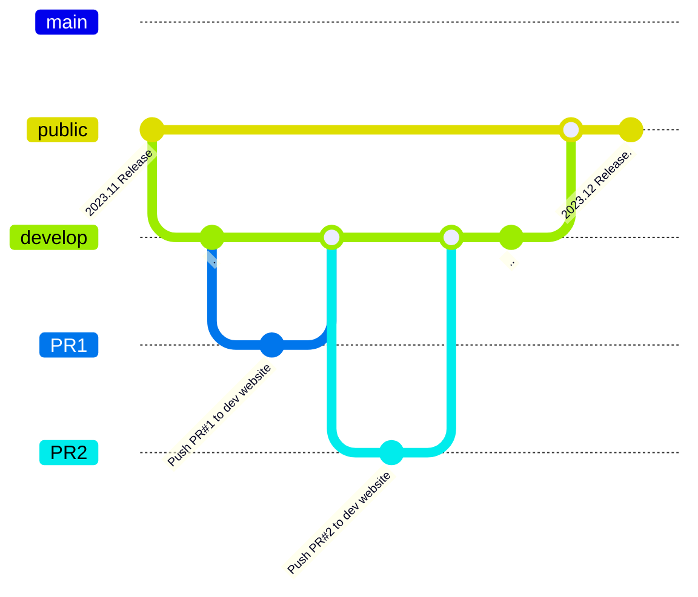
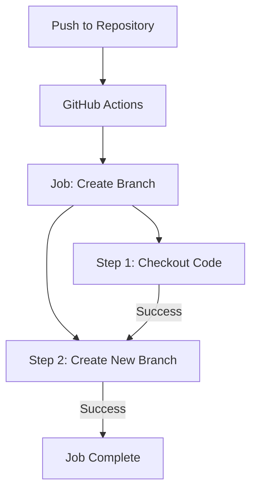
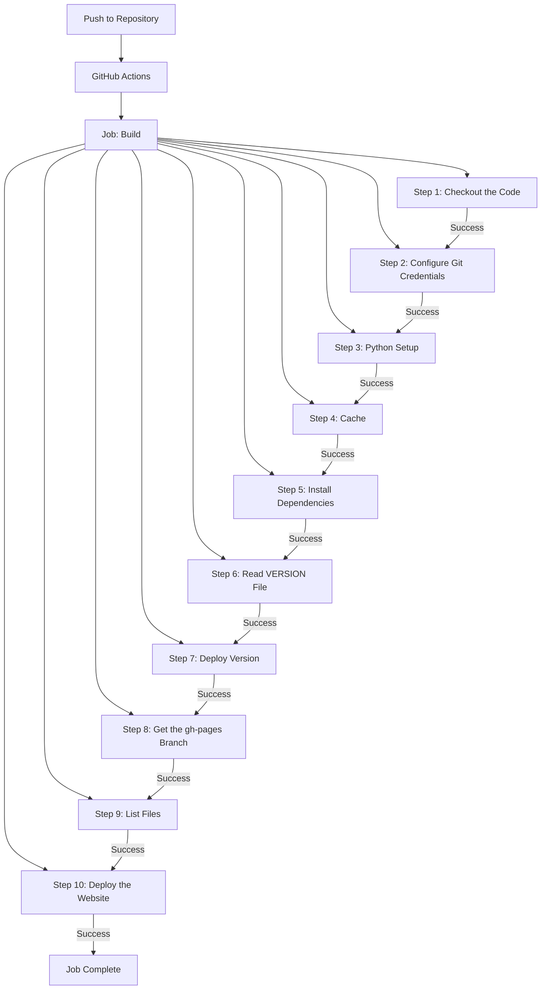
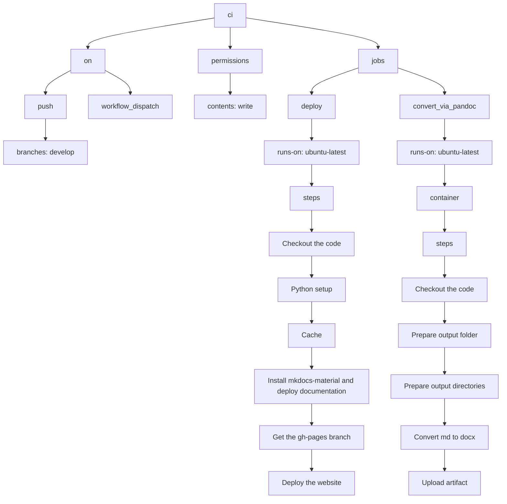

Two normal Pull Requests in a month when people are contributing to 'theblueprint'.

When all PRs are approved the develop branch is merged into the public branch

``` mermaid
gitGraph
    branch public
    commit id: "2023.11 Release"
    branch develop
    checkout develop
    commit id: "."
    branch PR1
    commit id: "Push PR#1 to dev website"
    checkout develop
    merge PR1
    branch PR2
    commit id: "Push PR#2 to dev website"
    checkout develop
    merge PR2
    commit id: ".."
    checkout public
    merge develop
    commit id: "2023.12 Release."
```

```mermaid
graph TB
    A[Push to Repository] --> B[GitHub Actions]
    B --> C[Job: Create Branch]
    C --> D[Step 1: Checkout Code]
    C --> E[Step 2: Create New Branch]
    D -->|Success| E
    E -->|Success| F[Job Complete]


```

```mermaid
graph TB
    A[Push to Repository] --> B[GitHub Actions]
    B --> C[Job: Build]
    C --> D[Step 1: Checkout the Code]
    C --> E[Step 2: Configure Git Credentials]
    C --> F[Step 3: Python Setup]
    C --> G[Step 4: Cache]
    C --> H[Step 5: Install Dependencies]
    C --> I[Step 6: Read VERSION File]
    C --> J[Step 7: Deploy Version]
    C --> K[Step 8: Get the gh-pages Branch]
    C --> L[Step 9: List Files]
    C --> M[Step 10: Deploy the Website]
    D -->|Success| E
    E -->|Success| F
    F -->|Success| G
    G -->|Success| H
    H -->|Success| I
    I -->|Success| J
    J -->|Success| K
    K -->|Success| L
    L -->|Success| M
    M -->|Success| N[Job Complete]

```

```mermaid
graph TB
    A[ci] --> B[on]
    B --> C[push]
    C --> D[branches: develop]
    B --> E[workflow_dispatch]
    A --> F[permissions]
    F --> G[contents: write]
    A --> H[jobs]
    H --> I[deploy]
    I --> J[runs-on: ubuntu-latest]
    J --> K[steps]
    K --> L[Checkout the code]
    L --> M[Python setup]
    M --> N[Cache]
    N --> O[Install mkdocs-material and deploy documentation]
    O --> P[Get the gh-pages branch]
    P --> Q[Deploy the website]
    H --> R[convert_via_pandoc]
    R --> S[runs-on: ubuntu-latest]
    S --> T[container]
    T --> U[steps]
    U --> V[Checkout the code]
    V --> W[Prepare output folder]
    W --> X[Prepare output directories]
    X --> Y[Convert md to docx]
    Y --> Z[Upload artifact]
```
